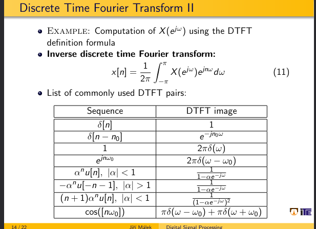
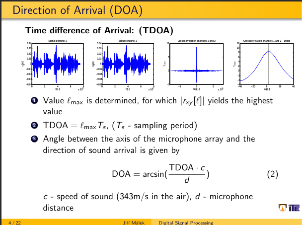

pokud mame nizkou vzorkovaci frekvenci, mene presne mereni uhlu dopadu

ridky spektrum je vhodne pro kompresi

dtft se bezne nepouziva, potreba nekonecny signal, nutne navzorkovat

jak udelat goniometricke funkce pro komplexni cisla

u pocitani pouzit euleruv vztah, nahore na fotce

transofrmace dle tabulky v prezentaci

vstupni signal realnej -> vystup musi zustat sudy

transformovat dle aditiviti, nebo prevest na te soucet

jak spocitat magnitudu a fazi, obrazek ve fotaku 2

roztahnout komplexni svaly!